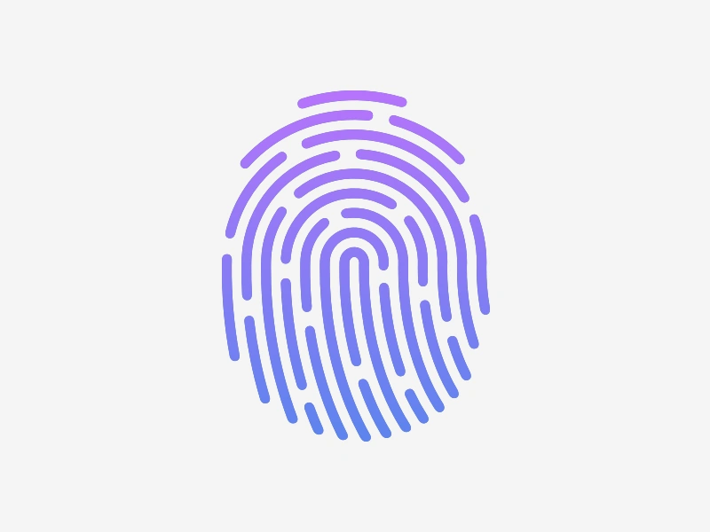

# NetTrace

**NetTrace** is a Python-based keylogger application developed to simulate the behavior of spyware. My capstone project highlights the potential risks of malicious software, emphasizing the importance of cybersecurity awareness.

<br>



# Overview

NetTrace is an advanced key logging and system monitoring tool designed for security professionals and ethical hackers. Unlike traditional keyloggers, NetTrace provides comprehensive system surveillance capabilities, including:

- Keystroke logging with sentence-level capture

- Clipboard monitoring to capture copied passwords and sensitive data

- Screenshot capture for visual context

- Audio recording to monitor surroundings

- System information collection for device profiling

- Cloud storage via Firebase for remote log access

<br>

Warning: This tool is intended for legal security research and authorized penetration testing only. Unauthorized use may violate privacy laws.

## Features
### Comprehensive Data Collection

- Keystroke Logging: Captures typed sentences when Enter is pressed

- Clipboard Monitoring: Records all copied text (including passwords)

- Visual Context: Takes screenshots of the victim's screen

- Audio Surveillance: Records ambient audio (5-second clips)

- System Profiling: Collects hostname, processor, and OS details

### Cloud Integration

- Firebase Backend: All logs are automatically uploaded to Firestore

- Organized Collections: Logs are stored in numbered collections (log1, log2, etc.)

- Document-based Storage: Each data type is stored as a separate document

### Stealth Operation

- Runs silently in the background

- No visible interface when executing

- Automatic log rotation with collection numbering

## Technical Details
### System Requirements

- Python 3.6+

- macOS or Windows (Linux support experimental)

- Firebase service account credentials

### Dependencies
```
pip install firebase-admin pyperclip pyaudio pyscreenshot pynput
```

### Installation
1. Clone the repository:
```
git clone https://github.com/yourusername/NetTrace.git
cd NetTrace
```

2. Set up Firebase:

- Create a Firebase project

- Download your service account JSON file

- Place it in /path/to/advanced_key_logs/service_account_key/

3. Run the keylogger:
```
python3 advanced_key_logger.py
```

## Usage Examples
### Typical Attack Scenario

1. Victim searches for "chase bank login" (logged in key_log.txt)

2. Victim copies password "hanoon123" (captured in clipboard.txt)

3. Victim enters credentials on Chase login page (screenshot.png captures the page)

4. All data is uploaded to Firebase in real-time

### Firebase Log Structure
```
log3/
  ├── audio_recording.wav
  ├── clipboard.txt       # 'hanoon123'
  ├── key_log.txt         # 'chase bank login'
  ├── screenshot.png
  └── system.txt          # Hostname, OS details
```

### Sample Output
```
Using collection log3 for this run.
Log system.txt successfully stored in Firestore under collection log3.
Log clipboard.txt successfully stored in Firestore under collection log3.
Log screenshot.png successfully stored in Firestore under collection log3.
Recording Audio...
Log audio_recording.wav successfully stored in Firestore under collection log3.
Audio recording finished.
Logged sentence: chase bank login
```

## Ethical Considerations

NetTrace should only be used:

- For authorized security testing

- With explicit consent from monitored parties

- In compliance with all applicable laws

Unauthorized use may violate:

- Computer Fraud and Abuse Act (CFAA)

- Electronic Communications Privacy Act

- Various state privacy laws

## Documentation
### Key Functions

`collect_system_info()`: Gathers hostname, processor, and OS details

`log_clipboard_contents()`: Monitors and records clipboard changes

`capture_screenshot()`: Takes full-screen captures

`record_audio()`: Records 5-second audio clips

`record_keystrokes()`: Logs complete sentences on Enter key press

### Customization
Modify these variables in the script for preferred time intervals:
```
log_interval = 15          # Seconds between log cycles
duration = 5               # Audio recording length
log_directory = "/path/to/logs"  # Local log storage
```

## Disclaimer

This tool is provided for educational and authorized security testing purposes only. The developers assume no liability and are not responsible for any misuse or damage caused by this program. Always ensure you have proper authorization before using NetTrace on any system.


## Key Features
- **Keystroke Logging**: Captures user inputs from the keyboard in real time.
- **Clipboard Monitoring**: Tracks and logs clipboard data for further analysis.
- **Audio Recording**: Captures audio through system microphones.
- **Screenshot Capturing**: Takes periodic screenshots of the user's system.
- **Cloud Integration**: Utilizes Firebase Firestore for secure storage of logs and seamless real-time data management.

## Technologies Used
- **Python Libraries**:
  - `Pynput`: For keylogging functionalities.
  - `Pyperclip`: For clipboard monitoring.
  - `PyAudio`: For audio capture.
  - `PyScreenshot`: For capturing system screenshots.
- **Cloud Storage**: Firebase Firestore for secure and real-time data management.

## Purpose
This project serves as an educational tool, providing insights into the operations of spyware to promote cybersecurity awareness. **NetTrace** demonstrates how seemingly innocuous tools can compromise user privacy and security, stressing the need for vigilance against phishing and malware attacks.

## Future Enhancements
- Implementing user-specific log file naming for better data organization.
- Expanding cross-platform compatibility to support both Windows and Linux environments.
